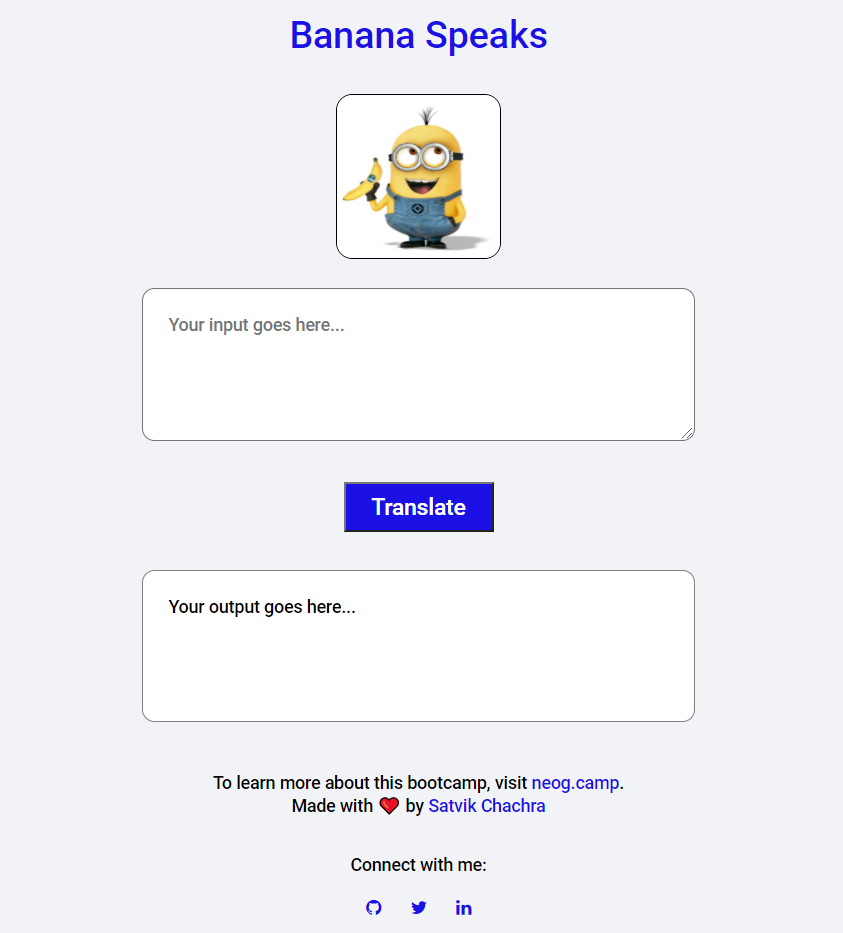

# BananaSpeaks
* Talk like a Minion with this handy English-to-Minion Translator Web App.
* A part of submission of an assignment for neogcamp.

### View Live Demo
<pre><a href="https://satvikchachra-banana-speaks.netlify.app"><b>satvikchachra-banana-speaks.netlify.app</b></a></pre>

### Features
* Translates English to Minion.
* Error Handling

### Image

  
Landing Page

    

This language is spoken by the minions in Despicable Me.
 
The language is actually lots of languages. 
 
This website illustrates the use of <b>Fetch API.</b>
 
 
Have fun playing!
 
Yi kai yai yai bananna! 

##### Built with ♥ by <a href="https://github.com/satvikchachra">satvikchachra</a>

